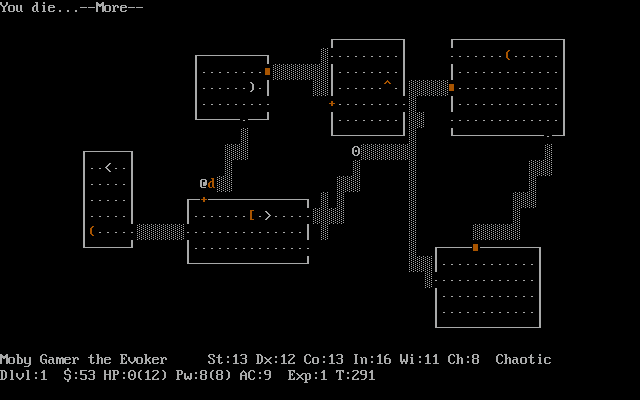
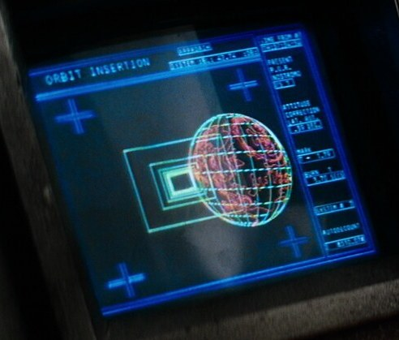
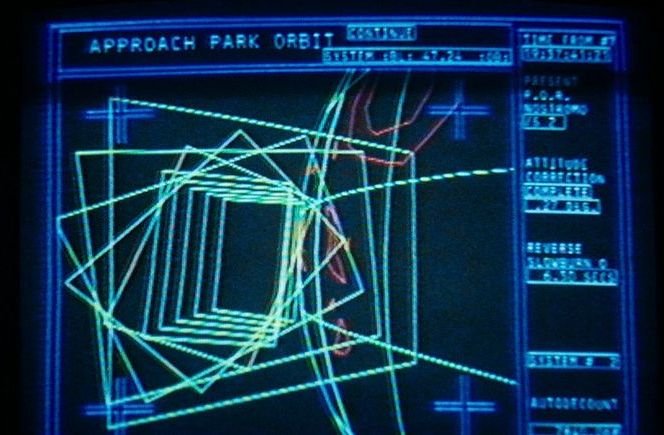

To read the formatted version of this README, view it here https://github.com/Grapes42/pyeth/blob/main/README.md

```
                                  +------+
 ____             _   _          /|     /|
|  _ \ _   _  ___| |_| |__      +-+----+ |
| |_) | | | |/ _ \ __| '_ \     | |    | |
|  __/| |_| |  __/ |_| | | |    | +----+-+
|_|    \__, |\___|\__|_| |_|    |/     |/ 
       |___/                    +------+  
```
Pyeth (pronounced pie-eth) is a text based 3D rendering engine made with Python. It can be used to create 3D games and applications with that classic ASCII charm. Make the text green and you've got graphics straight out of an 80's sci fi movie.

## How to run
### Windows
Right-click ```run_windows.py``` $\rightarrow$ click run with python

This will auto-install dependencies and run the program.

If this doesn't work for whatever reason, dependencies can be installed via
```
$ pip install -r code/requirements.txt
```
or
```
$ pip install numpy
$ pip install opencv-python
$ pip install pygame
```
### Linux
```
$ ./run_linux.sh
```
This will auto-install dependencies and run the program.

## Future Plans
I have many plans to use this program to create some 80's sci-fi-esque
games inspired by computer graphics in the likes of "Alien (1979)". 
And some 3D versions of classic rouguelikes like "Nethack".

|Nethack|Alien Computers|
|-|-|
|||

