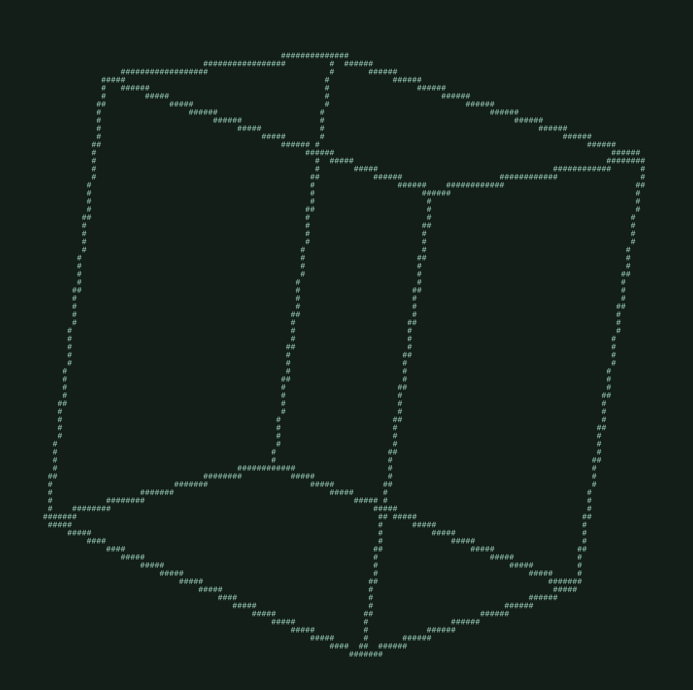

# Pyeth
Pyeth (pronounced pie-eth) is a text based 3D rendering engine made with Python. It can be used to create 3D games and applications with that classic ASCII charm. Make the text green and you've got graphics straight out of an 80's sci fi movie.

## Future Plans
Pyeth will be used to create an cross between classic Roguelikes like *Nethack* and early 90's dungeon crawlers such like *Dungeon Hack*

|Nethack|Dungeon Hack|
|-|-|
|||

